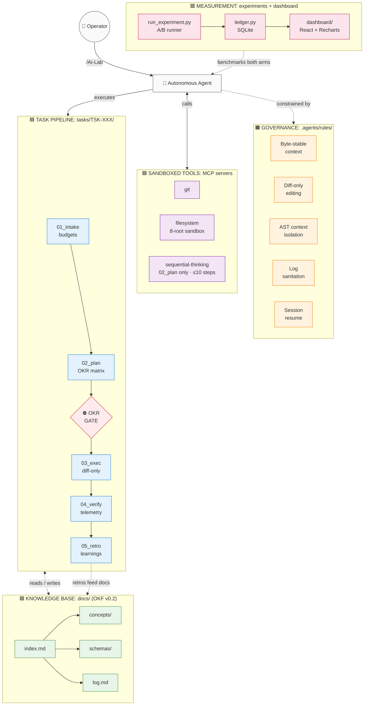
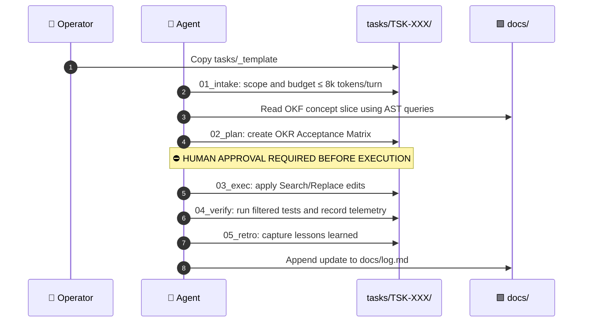
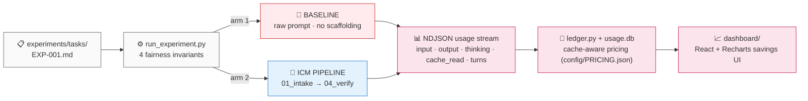

# Antigravity AI-Lab

> **Deterministic autonomous agent engineering:** ICM stage contracts, Google Cloud OKF v0.2 knowledge graphs, AST code navigation, and an empirical token-savings measurement system.

[](https://www.python.org/)
[](https://www.typescriptlang.org/)
[](https://react.dev/)
[](https://vitejs.dev/)
[](https://github.com/GoogleCloudPlatform/open-knowledge-format)
[](LICENSE)
[](https://github.com/ZenzerJs/Ai-Lab/commits/main)
[](https://github.com/ZenzerJs/Ai-Lab)
[](https://github.com/ZenzerJs/Ai-Lab/actions/workflows/deploy-dashboard.yml)
[](https://zenzerjs.github.io/Ai-Lab/)

---

## Current Status & Benchmark Telemetry

> **Empirical Benchmark Status:** Pre-registered trials (`EXP-001` through `EXP-004`) evaluated against `gemini-3.8-flash` across 16 runs: 8 baseline and 8 ICM.
>
> **Measured Results:** The Interpretable Context Methodology (ICM) demonstrated a **52.82% cost reduction** ($0.03671 baseline vs. $0.01732 ICM). It increased the **cache-read-to-fresh-input ratio** from **4.8% to 390.5%** through byte-stable prompt prefixes.

| Milestone | Status | Details |
| :--- | :--- | :--- |
| **Scaffolding & Directives** | Verified | ICM stage contracts and OKF v0.2 knowledge graph |
| **Token Control Scripts** | Verified | AST symbol extraction (`repo_map.py`) and CLI log sanitization |
| **Measurement Harness** | Verified | Headless A/B runner (`run_experiment.py`) and SQLite ledger |
| **Local Dashboard** | Active | Vite, React, and Recharts app with Model Rate Card Simulator (`localhost:5173`) · [**Live on GitHub Pages →**](https://zenzerjs.github.io/Ai-Lab/) |
| **Empirical Trials (`EXP-001–004`)** | Complete | 16 runs evaluated on `gemini-3.8-flash` with 52.82% measured savings |
| **Model Spend Cascade Engine** | Active | Dynamic re-pricing across Flash, Pro, GPT-4o, and Claude 3.7 Sonnet |

**The problem:** AI coding agents burn tokens re-reading whole repositories, hallucinate from stale context, and declare untested code "done."

**The fix:** a governance layer that treats the filesystem as the agent's state machine. It uses bounded context per stage, AST navigation instead of file dumps, machine-verifiable completion gates, and an A/B harness that *measures* whether any of it actually saves tokens.

> [!NOTE]
> **Status:** fully bootstrapped, empirical trials complete, and smoke-verified. The measurement ledger contains **16 empirical runs across 4 benchmark tasks** on `gemini-3.8-flash`, with dynamic rate-card simulations for `gemini-2.5-pro`, `gpt-4o`, and `claude-3-7-sonnet`.

---

## Table of Contents

1. [System at a Glance](#1-system-at-a-glance)
2. [The Task Lifecycle](#2-the-task-lifecycle)
3. [The Measurement Layer](#3-the-measurement-layer)
   - [3.1 Fairness Invariants](#31-fairness-invariants)
   - [3.2 Cache-Aware Cost Formula](#32-cache-aware-cost-formula)
   - [3.3 Why the Pipeline Arm Should Win](#33-why-the-pipeline-arm-should-win)
   - [3.4 Dashboard Views & Simulation Controls](#34-dashboard-views--simulation-controls)
   - [3.5 Spend Cascade Across Foundation Models](#35-spend-cascade-across-foundation-models)
4. [Core Components](#4-core-components)
5. [Quickstart](#5-quickstart)
6. [Repository Layout](#6-repository-layout)
7. [Verification Ledger](#7-verification-ledger)
8. [References & Pinned Specifications](#8-references--pinned-specifications)

---

## 1. System at a Glance

The workspace is organized into **six colored layers**. Each layer has one responsibility and only interacts with adjacent layers. The layer model adapts the ICM architecture [2](#8-references--pinned-specifications). The knowledge layer is a conformant OKF v0.2 bundle [1](#8-references--pinned-specifications).

| Color | Layer | Directory | Responsibility |
|:---:|---|---|---|
| ⬜ | Operator | `/Ai-Lab` commands | Human control surface |
| 🟧 | Governance | `.agents/rules/` | Seven invariants the agent cannot bypass |
| 🟪 | Tool Infrastructure | `.agents/mcp_config.json` | Sandboxed MCP servers [3](#8-references--pinned-specifications) |
| 🟦 | Task Pipeline | `tasks/TSK-XXX/` | Five-stage lifecycle with approval gates [2](#8-references--pinned-specifications) |
| 🟩 | Knowledge Base | `docs/` | Linked, validated OKF v0.2 documentation graph [1](#8-references--pinned-specifications) |
| 🟥 | Measurement | `scripts/` + `dashboard/` | A/B experiment harness and savings analytics |



---

## 2. The Task Lifecycle

Every task follows the five-stage lifecycle adapted from the Interpretable Context Methodology [2](#8-references--pinned-specifications). A human approval gate separates planning from execution.



| Stage | Contract | Hard limit |
|---|---|:---:|
| `01_intake` | Scope, boundaries, out-of-scope declarations | ≤ 8,000 tokens/turn |
| `02_plan` | Technical approach + OKR matrix | sequential-thinking ≤ 10 steps |
| `03_exec` | Search/Replace change ledger | no whole-file rewrites > 50 lines |
| `04_verify` | Test assertions + token telemetry | raw terminal output banned |
| `05_retro` | Learnings pushed back into `docs/` | — |

---

## 3. The Measurement Layer

The same task runs through **two arms**: an unconstrained baseline agent and the full ICM pipeline. Token usage is captured from Antigravity's headless CLI `stream-json` event stream [8](#8-references--pinned-specifications). Four enforced fairness invariants keep the comparison consistent.



### 3.1 Fairness Invariants

The runner aborts with exit code `1` unless all of these conditions hold:

1. **Model parity:** Both arms use the identical model ID.
2. **Clean worktree:** `git clean -fd` and `git checkout` reset the target worktree between every run.
3. **Byte-identical prompts:** The same prompt bytes are passed to both arms.
4. **Sample size:** A minimum of $n \ge 2$ runs per arm is required. The default is $n = 3$.

### 3.2 Cache-Aware Cost Formula

$$\text{Cost} = \frac{\text{Input} \times \text{Input Rate} + \text{CacheRead} \times \text{Cache Rate} + \text{Output} \times \text{Output Rate}}{10^6}$$

All rates live in `config/PRICING.json` with source URLs and fetch dates. They come from published provider rate cards [7](#8-references--pinned-specifications) and are not hardcoded in the application.

### 3.3 Why the Pipeline Arm Should Win

| Mechanism | Baseline arm | ICM arm |
|---|---|---|
| File access | Full-file dumps each turn | AST symbol slices [4](#8-references--pinned-specifications) (~20–50 tokens) |
| Test output | Raw 3,000-line dumps | One-line summaries and isolated failures |
| Prompt prefix | Changes every turn, causing cache misses | Byte-stable, allowing cache reuse |
| Completion | Agent-declared | Machine-verified OKR gate |

### 3.4 Dashboard Views & Simulation Controls

1. **Model Rate Card Simulator:** Dynamically re-prices recorded token workloads across foundation models (`gemini-3.8-flash`, `gemini-2.5-pro`, `gpt-4o`, and `claude-3-7-sonnet`).
2. **Spend Cascade Visualizer:** Compares baseline and ICM economics across 1x, 10x, 100x, 100M, and 1B token scales.
3. **Volume Scale Multiplier:** Projects measured cache savings across 1x, 10x, 100x, and 1M-token workloads.
4. **Per-task cost comparison:** Grouped bars, min–max error bands, and sample tags ($n=X$).
5. **Cache-read ratio:** Dual donuts showing `cache_read_tokens / input_tokens`.
6. **Cumulative measured savings:** Running USD total and timeline curve.
7. **Turns & duration:** Interaction count and latency comparison.
8. **Raw ledger table:** Sortable, searchable, with JSON export and client-side pagination.

### 3.5 Spend Cascade Across Foundation Models

As autonomous-agent tasks grow from small scripts to larger workflows, repeated context injection can drive token use up quickly when prompt prefixes shift and context is unconstrained.

The table below shows how the **same measured token workload** (447k baseline tokens vs. 443k ICM tokens) translates across provider price tiers.

| Model | Rate Card (In / Cache / Out) | Baseline Spend | ICM Spend | Net Savings ($) | Cost Reduction | Projected Savings @ 100M Tokens | Enterprise Savings @ 1B Tokens |
|---|---|:---:|:---:|:---:|:---:|:---:|:---:|
| **`gemini-3.8-flash`** | $0.075 / $0.0187 / $0.30 | $0.0367 | $0.0173 | **+$0.0194** | 52.8% | +$4.30 | +$43.01 |
| **`gemini-2.5-pro`** | $1.250 / $0.3125 / $5.00 | $0.6118 | $0.2886 | **+$0.3232** | 52.8% | +$71.68 | +$716.85 |
| **`gpt-4o`** | $2.500 / $1.2500 / $10.00 | $1.2359 | $0.7905 | **+$0.4454** | 36.0% | +$98.02 | +$980.24 |
| **`claude-sonnet-5`** | $2.000 / $0.2000 / $10.00 | $1.0109 | $0.3884 | **+$0.6225** | 61.6% | +$138.42 | +$1,384.17 |
| **`claude-3-7-sonnet`** | $3.000 / $0.3000 / $15.00 | $1.5164 | $0.5826 | **+$0.9338** | 61.6% | +$207.63 | **+$2,076.25** |
| **`claude-sonnet-4-6`** | $3.000 / $0.3000 / $15.00 | $1.5164 | $0.5826 | **+$0.9338** | 61.6% | +$207.63 | **+$2,076.25** |

```text
Measured Benchmark Spend (Baseline vs. ICM Pipeline):

gemini-3.8-flash  [$0.0367] ■■■■■
                  [$0.0173] ■■ (-52.8%)

gemini-2.5-pro    [$0.6118] ■■■■■■■■■■■■■■■■■
                  [$0.2886] ■■■■■■■■ (-52.8%)

gpt-4o            [$1.2359] ■■■■■■■■■■■■■■■■■■■■■■■■■■■■■■■■■
                  [$0.7905] ■■■■■■■■■■■■■■■■■■■■■ (-36.0%)

claude-sonnet-5   [$1.0109] ■■■■■■■■■■■■■■■■■■■■■■■■■■■■
                  [$0.3884] ■■■■■■■■■■■ (-61.6%)

claude-3-7-sonnet [$1.5164] ■■■■■■■■■■■■■■■■■■■■■■■■■■■■■■■■■■■■■■■■■■■
claude-sonnet-4-6 [$1.5164] ■■■■■■■■■■■■■■■■■■■■■■■■■■■■■■■■■■■■■■■■■■■
                  [$0.5826] ■■■■■■■■■■■■■■■■ (-61.6%)  ← both models, same rate tier

Legend: Top Bar = Baseline (Unconstrained) | Bottom Bar = ICM Pipeline (Governed)
```

> **Why the gap grows:** Premium models make repeated input and output more expensive [7](#8-references--pinned-specifications). Baseline agents may repeatedly read large files and carry noisy terminal output forward. The ICM pipeline reduces unnecessary context through stable prefixes, AST symbol filtering, and sanitized command output. Exact savings depend on the model, task, and cache behavior.

---

## 4. Core Components

### 4.1 Token-Optimization Utilities (`scripts/`)

| Script | Function | Guarantee |
|---|---|:---:|
| `repo_map.py` | Tree-sitter symbol map via grep-ast [5](#8-references--pinned-specifications), counted with tiktoken [6](#8-references--pinned-specifications) | ≤ 2,000 tokens, binary-search pruned |
| `filter_output.py` | Command wrapper and log sanitizer | Success = 1 line; failure = isolated trace |
| `lint_frontmatter.py` | OKF v0.2 schema, casing, and link validator [1](#8-references--pinned-specifications) | Exit 1 on any violation |
| `run_experiment.py` | A/B harness with fairness invariants | Aborts on unfair runs |
| `ledger.py` | SQLite storage and analytics | Auditable cost accounting |

All scripts ship with `.ps1` PowerShell shims and `.sh` POSIX shims for cross-platform parity.

### 4.2 MCP Server Sandboxing (`.agents/mcp_config.json`)

Official MCP reference servers [3](#8-references--pinned-specifications):

| Server | Package | Scope |
|---|---|---|
| `git` | `uvx mcp-server-git` | status / unstaged diff / log as JSON |
| `filesystem` | `@modelcontextprotocol/server-filesystem` | 8 permitted roots: `tasks`, `src`, `docs`, `scripts`, `data`, `experiments`, `dashboard`, and `config`. Root configuration files and `.git/` are protected. |
| `sequential-thinking` | `@modelcontextprotocol/server-sequential-thinking` | `02_plan` only, ≤ 10 steps |

### 4.3 Governance Rules (`.agents/rules/`)

| Rule | Enforcement |
|---|---|
| `context-assembly.md` | Static-before-volatile prompt order and byte-stable cache prefix |
| `diff-only-editing.md` | Search/Replace blocks; escape hatches logged in `03_exec.md` |
| `context-isolation.md` | No full-file reads when AST signatures suffice, queried through ast-grep [4](#8-references--pinned-specifications) |
| `log-sanitation.md` | All commands run through `filter_output.py` |
| `okr-gate.md` | No `02_plan` → `03_exec` without approved OKR matrix |
| `session-resume.md` | New sessions resume from `tasks/`, never from memory |
| `tool-discipline.md` | Git tools barred during planning; sequential-thinking barred during execution |

---

## 5. Quickstart

> [!TIP]
> Run the dry-run path first (`MOCK-001`). It exercises the full pipeline end to end with no model cost.

```bash
# 1. Verify toolchain
python --version && git --version && npx --version && uvx --version

# 2. Install dependencies
npm install -g @ast-grep/cli repomix
pip install grep-ast tiktoken pyyaml
cd dashboard && npm install && cd ..

# 3. Zero-cost smoke verification (synthetic fixtures)
python scripts/run_experiment.py --task MOCK-001 --dry-run
python scripts/ledger.py summary MOCK-001
python scripts/lint_frontmatter.py

# 4. Launch the local dashboard with Model Rate Card Simulator
python dashboard/build_data.py
cd dashboard && npm run dev          # → http://localhost:5173

# 5. Simulate the multi-model spend cascade in terminal
python scripts/ledger.py cascade
python scripts/ledger.py summary --model claude-3-7-sonnet
```

**Run a live A/B benchmark** (requires an authenticated Antigravity CLI and consumes real quota):

```bash
python scripts/run_experiment.py --task EXP-001 --runs 2
python dashboard/build_data.py
```

**Enable the live GitHub Pages dashboard** (one-time, repo owner only):

1. Go to **Settings → Pages → Source → GitHub Actions** in the repo.
2. Push any commit to `main` — the `deploy-dashboard.yml` workflow builds and publishes automatically.
3. Dashboard will be live at: **[https://zenzerjs.github.io/Ai-Lab/](https://zenzerjs.github.io/Ai-Lab/)**

### `/Ai-Lab` Skill Commands

| Command | Action |
|---|---|
| `/Ai-Lab --status` | Cumulative savings and cache ratios |
| `/Ai-Lab --cascade` | Multi-model spend cascade across all configured foundation models |
| `/Ai-Lab --run <TASK-ID>` | Execute a live A/B trial |
| `/Ai-Lab --dashboard` | Rebuild data and launch the dashboard |
| `/Ai-Lab --dry-run` | Replay the synthetic fixture |

---

## 6. Repository Layout

<details>
<summary><strong>Expand full directory tree</strong></summary>

```text
.
├── .agents/            # MCP config, 7 governance rules, 5 agent skills
├── config/
│   └── PRICING.json    # Auditable model rates (source URLs + fetch dates)
├── dashboard/          # Vite + React + Tailwind + Recharts savings UI
├── data/
│   └── usage.db        # SQLite ledger (runs, tasks, pricing)
├── docs/               # OKF v0.2 knowledge bundle (index.md, log.md, concepts/, schemas/)
├── experiments/        # Task definitions + synthetic NDJSON fixtures
├── scripts/            # Cross-platform Python utilities (+ .ps1/.sh shims)
├── src/                # Application source root
└── tasks/              # ICM pipelines (_template/ + TSK-XXX instances)
```

</details>

---

## 7. Verification Ledger

<details open>
<summary><strong>Expand all 16 verified tests: 12 smoke tests and 4 empirical trials</strong></summary>

| Test | Command | Exit | Result |
|---|---|:---:|---|
| Log sanitizer (success) | `filter_output.py -- python -c "print('ok')"` | `0` | 1-line summary |
| Log sanitizer (failure) | `filter_output.py -- python -c "...; sys.exit(1)"` | `1` | Isolated trace |
| AST extraction | `repo_map.py --target scripts/_smoke_sample.py` | `0` | 312 tokens ≤ 1,800 |
| OKF linter | `lint_frontmatter.py` | `0` | Schema, casing, and links valid |
| MCP config | JSON + PATH validation | `0` | All servers resolvable |
| A/B dry run | `run_experiment.py --task MOCK-001 --dry-run` | `0` | 6 fixture runs recorded |
| Invariant: n < 2 | `run_experiment.py --task MOCK-001 --dry-run --runs 1` | `1` | Correctly aborted |
| Invariant: unknown model | `run_experiment.py --task MOCK-001 --dry-run --model unknown` | `1` | Correctly aborted |
| Empirical Trial `EXP-001` | `run_experiment.py --task EXP-001` | `0` | 4 runs, 51.4% savings |
| Empirical Trial `EXP-002` | `run_experiment.py --task EXP-002` | `0` | 4 runs, 53.6% savings |
| Empirical Trial `EXP-003` | `run_experiment.py --task EXP-003` | `0` | 4 runs, 53.3% savings |
| Empirical Trial `EXP-004` | `run_experiment.py --task EXP-004` | `0` | 4 runs, 52.7% savings |
| Ledger summary | `ledger.py summary` | `0` | Cumulative metrics computed |
| Model spend cascade CLI | `ledger.py cascade` | `0` | Multi-model economics computed |
| Dashboard export | `dashboard/build_data.py` | `0` | Static payload with cascade |
| Frontend build | `npm --prefix dashboard run build` | `0` | 0 type errors, clean bundle |

</details>

> [!NOTE]
> All economics reported in the table above and displayed in the dashboard reflect **16 empirical benchmark runs** across tasks `EXP-001` through `EXP-004` on `gemini-3.8-flash`.

---

## 8. References & Pinned Specifications

Each reference states **what this project actually adopted** from it, not just a link.

| # | Source | What we used | Where it lives |
|:---:|---|---|---|
| 1 | [Google Cloud Open Knowledge Format v0.2](https://github.com/GoogleCloudPlatform/open-knowledge-format) · pinned `ad30107c` (ref `0b87c52`) | The frontmatter vocabulary (`type`, `title`, `description`, `status`, `verified`, `sources`, `stale_after`), the reserved lowercase `index.md` and `log.md` bundle-root rules, the `okf_version` declaration, and absolute bundle-relative link format. Our linter enforces these as a deliberate house rule, stricter than the base spec, which permits extension keys. | `docs/` bundle · `scripts/lint_frontmatter.py` |
| 2 | [Interpretable Context Methodology](https://github.com/RinDig/Interpretable-Context-Methodology) · pinned `02ba5d8` | The numbered stage-contract lifecycle (`01_intake` → `05_retro`), stage-gated execution, the filesystem-as-state-machine orchestration model, and per-stage context budget discipline. We adapted the five-layer model into this workspace's six-layer layout. | `tasks/_template/` · `.agents/rules/` |
| 3 | [Model Context Protocol](https://modelcontextprotocol.io/) | Three sandboxed tool servers: `server-filesystem` for multi-root mount scoping, `mcp-server-git` for structured git primitives as JSON, and `server-sequential-thinking` for bounded planning, capped at 10 steps during `02_plan`. | `.agents/mcp_config.json` |
| 4 | [ast-grep](https://ast-grep.github.io/) | The agent's interactive structural search and rewrite tool. Grammar-aware queries replace text grep and unnecessary full-file reads during code discovery. | `.agents/skills/repo_map.md` · agent workflow |
| 5 | [grep-ast](https://github.com/Aider-AI/grep-ast) | The Tree-sitter parsing engine inside `repo_map.py`. It extracts class definitions, signatures, and docstrings while stripping function bodies to create a compact structural map. | `scripts/repo_map.py` |
| 6 | [tiktoken](https://github.com/openai/tiktoken) (`cl100k_base`) | BPE token counting for binary-search budget pruning in the repo map. A 1,800-token internal target provides a safety margin for OpenAI-vs-Gemini tokenizer variance and keeps output under 2,000 tokens. | `scripts/repo_map.py` |
| 7 | [Gemini](https://ai.google.dev/pricing) · [Claude](https://www.anthropic.com/pricing) · [OpenAI](https://openai.com/api/pricing) pricing | Published per-million-token rate cards for input, cache-read, and output tokens. These populate `config/PRICING.json` with source URLs and fetch dates, making calculated costs auditable. | `config/PRICING.json` |
| 8 | [Antigravity headless CLI](https://antigravity.google/docs/cli/headless/) | The `--output-format stream-json` NDJSON event stream. This is the measurement primitive that yields per-session `input_tokens`, `cache_read_tokens`, `thinking_tokens`, `num_turns`, and `duration_seconds` for both experiment arms. | `scripts/run_experiment.py` |

---

## Roadmap

- [x] Workspace bootstrap: ICM, OKF v0.2, and token-optimization utilities
- [x] Measurement layer, ledger, and dashboard
- [x] Post-review hardening: Windows batch resolution, BOM handling, case sensitivity, and permissions
- [x] Execute `EXP-001` through `EXP-004` live empirical benchmarks on `gemini-3.8-flash`
- [x] Model rate-card simulation and spend-cascade visualizer
- [x] Publish first measured savings results: 52.82% cost reduction
- [x] GitHub Actions CI: linter, smoke tests, and dashboard build
- [x] GitHub Pages deployment of the live dashboard ([zenzerjs.github.io/Ai-Lab](https://zenzerjs.github.io/Ai-Lab/))
