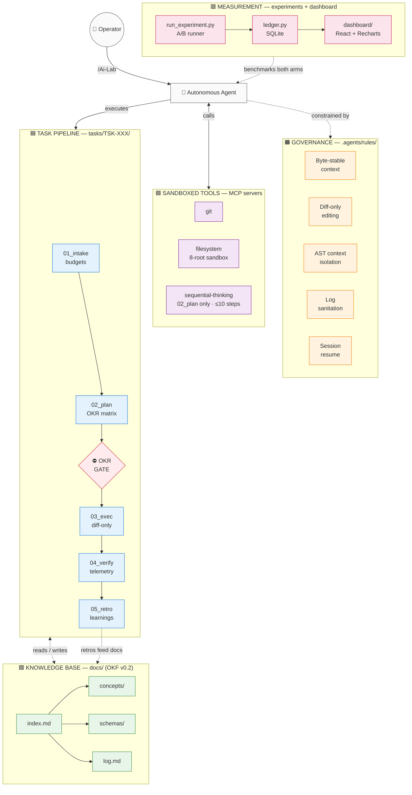
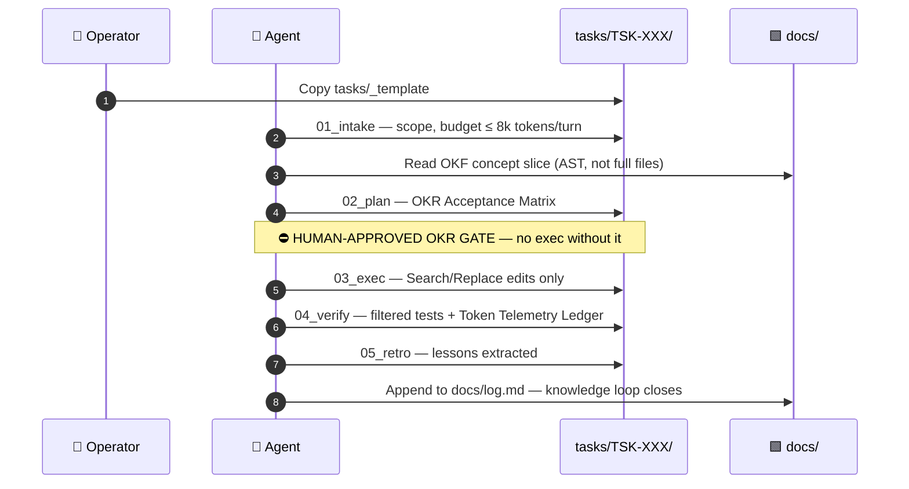
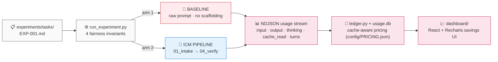

# Antigravity AI-Lab

> **Deterministic autonomous agent engineering** — ICM stage contracts, Google Cloud OKF v0.2 knowledge graphs, AST code navigation, and an empirical token-savings measurement system.

[](https://www.python.org/)
[](https://www.typescriptlang.org/)
[](https://react.dev/)
[](https://vitejs.dev/)
[](https://github.com/GoogleCloudPlatform/open-knowledge-format)
[](https://github.com/ZenzerJs/Ai-Lab/commits/main)
[](https://github.com/ZenzerJs/Ai-Lab)
[](LICENSE)

**The problem:** AI coding agents burn tokens re-reading whole repositories, hallucinate from stale context, and declare untested code "done."

**The fix:** a governance layer that treats the filesystem as the agent's state machine — bounded context per stage, AST navigation instead of file dumps, machine-verifiable completion gates, and an A/B harness that *measures* whether any of it actually saves tokens.

> [!NOTE]
> **Status:** fully bootstrapped and smoke-verified. The measurement ledger currently contains **synthetic fixture data only** — the first live benchmark (`EXP-001`) has not yet been executed. No percentage claims on this page are measured results.

---

## Table of Contents

1. [System at a Glance](#1-system-at-a-glance)
2. [The Task Lifecycle](#2-the-task-lifecycle)
3. [The Measurement Layer](#3-the-measurement-layer)
4. [Core Components](#4-core-components)
5. [Quickstart](#5-quickstart)
6. [Repository Layout](#6-repository-layout)
7. [Verification Ledger](#7-verification-ledger)
8. [References & Pinned Specifications](#8-references--pinned-specifications)

---

## 1. System at a Glance

The workspace is organized as **six colored layers**. Each layer has one responsibility and touches only its neighbors. The layer model adapts the ICM architecture [2](#8-references--pinned-specifications); the knowledge layer is a conformant OKF v0.2 bundle [1](#8-references--pinned-specifications).

| Color | Layer | Directory | Responsibility |
|:---:|---|---|---|
| ⬜ | Operator | `/Ai-Lab` commands | Human control surface |
| 🟧 | Governance | `.agents/rules/` | Seven invariants the agent cannot bypass |
| 🟪 | Tool Infrastructure | `.agents/mcp_config.json` | Sandboxed MCP servers [3](#8-references--pinned-specifications) |
| 🟦 | Task Pipeline | `tasks/TSK-XXX/` | Five-stage lifecycle with approval gates [2](#8-references--pinned-specifications) |
| 🟩 | Knowledge Base | `docs/` | Linked, validated OKF v0.2 documentation graph [1](#8-references--pinned-specifications) |
| 🟥 | Measurement | `scripts/` + `dashboard/` | A/B experiment harness and savings analytics |



---

## 2. The Task Lifecycle

Every task executes the five-contract lifecycle defined by the Interpretable Context Methodology [2](#8-references--pinned-specifications), with one hard human-approval gate between planning and execution:



| Stage | Contract | Hard limit |
|---|---|:---:|
| `01_intake` | Scope, boundaries, out-of-scope declarations | ≤ 8,000 tokens/turn |
| `02_plan` | Technical approach + OKR matrix | sequential-thinking ≤ 10 steps |
| `03_exec` | Search/Replace change ledger | no whole-file rewrites > 50 lines |
| `04_verify` | Test assertions + token telemetry | raw terminal output banned |
| `05_retro` | Learnings pushed back into `docs/` | — |

---

## 3. The Measurement Layer

The same task runs through **two arms** — an unconstrained baseline agent and the full ICM pipeline — with token usage captured from the Antigravity headless CLI's `stream-json` event stream [8](#8-references--pinned-specifications), under four enforced fairness invariants:



### 3.1 Four Fairness Invariants

The runner aborts (exit `1`) unless all hold:

1. **Model parity** — both arms use the identical model ID.
2. **Clean worktree** — `git clean -fd` + `git checkout` reset between every run.
3. **Byte-identical prompts** — the same prompt bytes go to both arms.
4. **Sample size** — minimum $n \ge 2$ runs per arm (default $n = 3$).

### 3.2 Cache-Aware Cost Formula

$$\text{Cost} = \frac{\text{Input} \times \text{Input Rate} + \text{CacheRead} \times \text{Cache Rate} + \text{Output} \times \text{Output Rate}}{10^6}$$

All rates live in `config/PRICING.json` with source URLs and fetch dates — sourced from published provider rate cards [7](#8-references--pinned-specifications), never hardcoded.

### 3.3 Why the Pipeline Arm Should Win

| Mechanism | Baseline arm | ICM arm |
|---|---|---|
| File access | Full-file dumps each turn | AST symbol slices [4](#8-references--pinned-specifications) (~20–50 tokens) |
| Test output | Raw 3,000-line dumps | One-line summaries, isolated failures |
| Prompt prefix | Changes every turn (cache misses) | Byte-stable (cache hits at ~10% of input cost) |
| Completion | Agent-declared | Machine-verified OKR gate |

### 3.4 Dashboard Views

1. **Per-task cost comparison** — grouped bars, min–max error bands, sample tags ($n=X$)
2. **Cache hit ratio** — dual donuts (`cache_read_tokens / input_tokens`)
3. **Cumulative measured savings** — running USD total
4. **Turns & duration** — interaction count and latency
5. **Raw ledger table** — sortable, with JSON export

---

## 4. Core Components

### 4.1 Token-Optimization Utilities (`scripts/`)

| Script | Function | Guarantee |
|---|---|:---:|
| `repo_map.py` | Tree-sitter symbol map via grep-ast [5](#8-references--pinned-specifications), counted with tiktoken [6](#8-references--pinned-specifications) | ≤ 2,000 tokens, binary-search pruned |
| `filter_output.py` | Command wrapper & log sanitizer | Success = 1 line; failure = isolated trace |
| `lint_frontmatter.py` | OKF v0.2 schema, casing & link validator [1](#8-references--pinned-specifications) | Exit 1 on any violation |
| `run_experiment.py` | A/B harness with fairness invariants | Aborts on unfair runs |
| `ledger.py` | SQLite storage & analytics | Auditable cost accounting |

All scripts ship with `.ps1` (PowerShell) and `.sh` (POSIX) shims for cross-platform parity.

### 4.2 MCP Server Sandboxing (`.agents/mcp_config.json`)

Official MCP reference servers [3](#8-references--pinned-specifications):

| Server | Package | Scope |
|---|---|---|
| `git` | `uvx mcp-server-git` | status / unstaged diff / log as JSON |
| `filesystem` | `@modelcontextprotocol/server-filesystem` | 8 roots: `tasks`, `src`, `docs`, `scripts`, `data`, `experiments`, `dashboard`, `config` — root configs and `.git/` protected |
| `sequential-thinking` | `@modelcontextprotocol/server-sequential-thinking` | `02_plan` only, ≤ 10 steps |

### 4.3 Governance Rules (`.agents/rules/`)

| Rule | Enforcement |
|---|---|
| `context-assembly.md` | Static-before-volatile prompt order; byte-stable cache prefix |
| `diff-only-editing.md` | Search/Replace blocks; escape hatches logged in `03_exec.md` |
| `context-isolation.md` | No full-file reads when AST signatures suffice (queried via ast-grep [4](#8-references--pinned-specifications)) |
| `log-sanitation.md` | All commands via `filter_output.py` |
| `okr-gate.md` | No `02_plan` → `03_exec` without approved OKR matrix |
| `session-resume.md` | New sessions resume from `tasks/`, never from memory |
| `tool-discipline.md` | Git tools barred during planning; sequential-thinking barred during exec |

---

## 5. Quickstart

> [!TIP]
> Run the dry-run path first (`MOCK-001`) — it exercises the entire pipeline end-to-end with zero model cost.

```bash
# 1. Verify toolchain
python --version && git --version && npx --version && uvx --version

# 2. Install dependencies
npm install -g @ast-grep/cli repomix
pip install grep-ast tiktoken pyyaml
cd dashboard && npm install && cd ..

# 3. Zero-cost smoke verification (synthetic fixtures)
python scripts/run_experiment.py --task MOCK-001 --dry-run
python scripts/ledger.py summary MOCK-001
python scripts/lint_frontmatter.py

# 4. Launch the local dashboard
python dashboard/build_data.py
cd dashboard && npm run dev          # → http://localhost:5173
```

**Run a live A/B benchmark** (requires authenticated Antigravity CLI; consumes real quota):

```bash
python scripts/run_experiment.py --task EXP-001 --runs 2
python dashboard/build_data.py
```

### `/Ai-Lab` Skill Commands

| Command | Action |
|---|---|
| `/Ai-Lab --status` | Cumulative savings and cache ratios |
| `/Ai-Lab --run <TASK-ID>` | Execute live A/B trial |
| `/Ai-Lab --dashboard` | Rebuild data + launch dashboard |
| `/Ai-Lab --dry-run` | Replay synthetic fixture |

---

## 6. Repository Layout

<details>
<summary><strong>Expand full directory tree</strong></summary>

```text
.
├── .agents/            # MCP config, 7 governance rules, 5 agent skills
├── config/
│   └── PRICING.json    # Auditable model rates (source URLs + fetch dates)
├── dashboard/          # Vite + React + Tailwind + Recharts savings UI
├── data/
│   └── usage.db        # SQLite ledger (runs, tasks, pricing)
├── docs/               # OKF v0.2 knowledge bundle (index.md, log.md, concepts/, schemas/)
├── experiments/        # Task definitions + synthetic NDJSON fixtures
├── scripts/            # Cross-platform Python utilities (+ .ps1/.sh shims)
├── src/                # Application source root
└── tasks/              # ICM pipelines (_template/ + TSK-XXX instances)
```

</details>

---

## 7. Verification Ledger

<details>
<summary><strong>Expand all 12 smoke tests</strong></summary>

| Test | Command | Exit | Result |
|---|---|:---:|---|
| Log sanitizer (success) | `filter_output.py -- python -c "print('ok')"` | `0` | 1-line summary |
| Log sanitizer (failure) | `filter_output.py -- python -c "...; sys.exit(1)"` | `1` | Isolated trace |
| AST extraction | `repo_map.py --target scripts/_smoke_sample.py` | `0` | 312 tokens ≤ 1,800 |
| OKF linter | `lint_frontmatter.py` | `0` | Schema, casing, links valid |
| MCP config | JSON + PATH validation | `0` | All servers resolvable |
| A/B dry run | `run_experiment.py --task MOCK-001 --dry-run` | `0` | 6 fixture runs recorded |
| Invariant: n < 2 | `run_experiment.py --dry-run --runs 1` | `1` | Correctly aborted |
| Invariant: unknown model | `run_experiment.py --dry-run --model unknown` | `1` | Correctly aborted |
| Ledger summary | `ledger.py summary MOCK-001` | `0` | Fixture economics computed |
| Dashboard export | `dashboard/build_data.py` | `0` | Valid static payload |
| Frontend build | `npm run build` | `0` | 0 type errors |
| Git pre-commit hook | `.git/hooks/pre-commit` | `0` | Drift prevention active |

</details>

> [!WARNING]
> All economics in the ledger above derive from **synthetic fixture data** (`MOCK-001`). Live benchmark results will be published here after `EXP-001` executes.

---

## 8. References & Pinned Specifications

Each reference states **what this project actually adopted** from it — not just a link.

| # | Source | What we used | Where it lives |
|:---:|---|---|---|
| 1 | [Google Cloud Open Knowledge Format v0.2](https://github.com/GoogleCloudPlatform/open-knowledge-format) · pinned `ad30107c` (ref `0b87c52`) | The frontmatter vocabulary (`type`, `title`, `description`, `status`, `verified`, `sources`, `stale_after`), the reserved lowercase `index.md` / `log.md` bundle-root rules, the `okf_version` declaration, and absolute bundle-relative link format. Our linter enforces these as a deliberate house rule (stricter than the base spec, which permits extension keys). | `docs/` bundle · `scripts/lint_frontmatter.py` |
| 2 | [Interpretable Context Methodology](https://github.com/RinDig/Interpretable-Context-Methodology) · pinned `02ba5d8` | The numbered stage-contract lifecycle (`01_intake` → `05_retro`), stage-gated execution, the "filesystem as state machine" orchestration model, and per-stage context budget discipline. We adapted the five-layer model into this workspace's six-layer layout. | `tasks/_template/` · `.agents/rules/` |
| 3 | [Model Context Protocol](https://modelcontextprotocol.io/) — official reference servers | All three sandboxed tool servers: `server-filesystem` (multi-root mount scoping), `mcp-server-git` (structured git primitives as JSON), and `server-sequential-thinking` (bounded planning, capped at 10 steps during `02_plan` only). | `.agents/mcp_config.json` |
| 4 | [ast-grep](https://ast-grep.github.io/) | The agent's interactive structural search and rewrite tool — grammar-aware queries replace text grep and full-file reads during code discovery. | `.agents/skills/repo_map.md` · agent workflow |
| 5 | [grep-ast](https://github.com/Aider-AI/grep-ast) | The Tree-sitter parsing engine inside `repo_map.py` — extracts class definitions, signatures, and docstrings while stripping function bodies, so a 1,000-line module compresses to a handful of tokens. | `scripts/repo_map.py` |
| 6 | [tiktoken](https://github.com/openai/tiktoken) (`cl100k_base`) | Exact BPE token counting for binary-search budget pruning in the repo map. A 1,800-token internal target absorbs OpenAI-vs-Gemini tokenizer variance, guaranteeing output stays under 2,000 tokens. | `scripts/repo_map.py` |
| 7 | [Gemini](https://ai.google.dev/pricing) · [Claude](https://www.anthropic.com/pricing) · [OpenAI](https://openai.com/api/pricing) pricing | Published per-million-token rate cards (input, cache-read, output) that populate `config/PRICING.json` with source URLs and fetch dates, making every computed cost auditable. | `config/PRICING.json` |
| 8 | [Antigravity headless CLI](https://antigravity.google/docs/cli/headless/) | The `--output-format stream-json` NDJSON event stream — the measurement primitive yielding exact per-session `input_tokens`, `cache_read_tokens`, `thinking_tokens`, `num_turns`, and `duration_seconds` for both experiment arms. | `scripts/run_experiment.py` |

---

## Roadmap

- [x] Workspace bootstrap (ICM + OKF v0.2 + token-optimization utilities)
- [x] Measurement layer, ledger, and dashboard
- [x] Post-review hardening (Windows batch resolution, BOM, case-sensitivity, permissions)
- [ ] Execute `EXP-001` — first live A/B benchmark (gemini-3.8-flash)
- [ ] Publish first measured savings results
- [ ] GitHub Actions CI (linter + smoke tests + dashboard build)
- [ ] GitHub Pages deployment of the live dashboard
