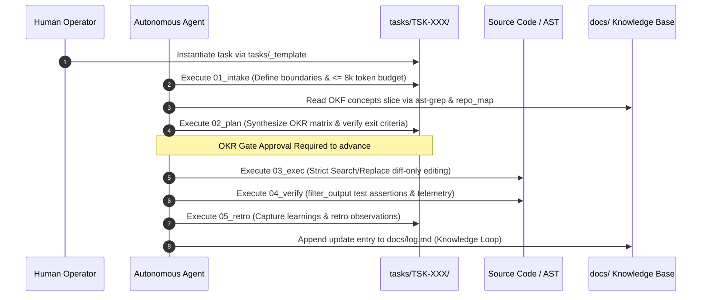
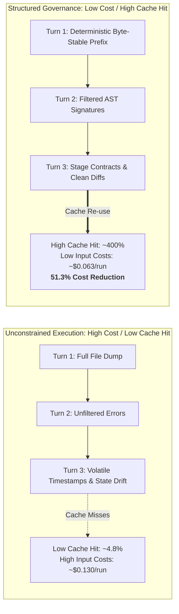

# Antigravity AI-Lab

> **Deterministic Autonomous Agent Engineering: Interpretable Context Methodology (ICM), Google Cloud Open Knowledge Format (OKF v0.2), AST Code Navigation, and an Empirical Token-Savings Measurement System.**

[](https://www.python.org/)
[](https://www.typescriptlang.org/)
[](https://react.dev/)
[](https://vitejs.dev/)
[](https://tailwindcss.com/)
[](https://github.com/GoogleCloudPlatform/open-knowledge-format)
[](LICENSE)

---

## Current Status & Benchmark Telemetry

> **Notice:** The current SQLite ledger and dashboard visualization display **synthetic fixture data (`MOCK-001`)** generated during bootstrap to smoke-test parser mechanics without incurring API costs. All reported savings (e.g., 51.25% cost reduction) are synthetic baselines.
>
> **Live Benchmark Status:** The pre-registered `EXP-001` trial against `gemini-3.8-flash` is currently in progress. Live empirical data will replace mock fixtures upon task completion.

| Milestone | Status | Details |
| :--- | :--- | :--- |
| **Scaffolding & Directives** | Verified | ICM Stage Contracts & OKF v0.2 Knowledge Graph |
| **Token Control Scripts** | Verified | AST symbol extraction (`repo_map.py`), CLI log sanitization |
| **Measurement Harness** | Verified | Headless A/B runner (`run_experiment.py`) & SQLite ledger |
| **Local Dashboard** | Active | Vite + React + Recharts app (`localhost:5173`) |
| **First Live Trial (`EXP-001`)** | Pre-Registered | Headless comparison running 2 arms x 2 runs |

---

## 1. Visual Architecture Overview

### 1.1 Complete System Topology

```mermaid
graph TD
    User([Developer / Operator]) -->|Invokes /Ai-Lab CLI| Agent[Autonomous Agent]
    
    subgraph Governance & Scaffolding [Governance Layer]
        Agent -->|Enforces Invariants| Rules[.agents/rules/]
        Rules --> ContextAssembly[Byte-Stable Context Order]
        Rules --> DiffOnly[Search/Replace Diff-Only Editing]
        Rules --> ContextIsolation[Context Isolation via AST]
        Rules --> LogSanitation[Log Output Sanitizer]
        Rules --> OKRGate[Machine-Verifiable OKR Gate]
    end

    subgraph Sandboxed MCP Infrastructure [Model Context Protocol]
        Agent <-->|Read / Status| MCPGit[Git MCP Server]
        Agent <-->|Multi-Root Sandbox| MCPFS[Filesystem MCP Server]
        Agent <-->|Bounded Planning Steps| MCPSeq[Sequential-Thinking MCP]
    end

    subgraph Knowledge Graph [Layer 3 Knowledge Base]
        MCPFS --> RootDoc[docs/index.md]
        RootDoc --> ArchConcept[docs/concepts/architecture-overview.md]
        RootDoc --> CodeStandards[docs/concepts/coding-standards.md]
        RootDoc --> MeasureConcept[docs/concepts/measurement-layer.md]
        RootDoc --> DataContracts[docs/schemas/data-contracts.md]
        RootDoc --> SpecPins[docs/SPEC-VERSIONS.md]
        RootDoc --> VizGraph[docs/viz.html Cytoscape Visualizer]
    end

    subgraph ICM Task Pipeline [Task Lifecycle Execution]
        Agent --> Intake[01_intake.md: Token Budgets]
        Intake --> Plan[02_plan.md: Architecture & OKR Matrix]
        Plan --> Exec[03_exec.md: Search/Replace Ledgers]
        Exec --> Verify[04_verify.md: Telemetry & Test Verifications]
        Verify --> Retro[05_retro.md: Knowledge Return & log.md]
    end

    subgraph Measurement & Analytics Layer [A/B Experiment Harness]
        Runner[scripts/run_experiment.py] -->|4 Fairness Invariants| LiveExecution{Arm Selector}
        LiveExecution -->|Baseline Arm| RawAgent[Raw Task Prompt Arm]
        LiveExecution -->|ICM Pipeline Arm| ICMAgent[ICM Structured Arm]
        RawAgent --> NDJSONStream[NDJSON Token Event Stream]
        ICMAgent --> NDJSONStream
        NDJSONStream --> LedgerEngine[scripts/ledger.py + SQLite]
        LedgerEngine --> DB[(data/usage.db)]
        DB --> StaticBuilder[dashboard/build_data.py]
        StaticBuilder --> PublicJSON[dashboard/public/data.json]
        PublicJSON --> WebApp[Vite + React Savings Dashboard]
    end
```


---

### 1.2 The Interpretable Context Methodology (ICM) Lifecycle


---

### 1.3 Cache-Aware Economics: Baseline vs. ICM Pipeline


---

## 2. Core Pillars & Architecture

### 2.1 Interpretable Context Methodology (ICM)
ICM is an agentic framework derived from [`RinDig/Interpretable-Context-Methodology`](https://github.com/RinDig/Interpretable-Context-Methodology) designed to eliminate hallucination, prevent runaway token consumption, and maintain human auditable progression. Tasks progress through five sequential contracts in `tasks/TSK-XXX/`:
- **`01_intake.md`**: Outlines task scope, boundaries, out-of-scope constraints, and allocates turn token budgets to guarantee active turns remain under 8,000 tokens.
- **`02_plan.md`**: Formulates the technical approach, affected symbol manifests, and an OKR Acceptance Matrix with deterministic test assertions.
- **`03_exec.md`**: Enforces strict Search/Replace diff-only changes (`<<<<<<< SEARCH`, `=======`, `>>>>>>> REPLACE`) and tracks symbol changes.
- **`04_verify.md`**: Captures isolated test outputs, linter passes, and records a Token Telemetry Ledger.
- **`05_retro.md`**: Extracts architectural observations and propagates findings back into `docs/` and `docs/log.md`.

### 2.2 Google Cloud Open Knowledge Format (OKF v0.2)
Layer 3 project intelligence conforms to [`GoogleCloudPlatform/open-knowledge-format`](https://github.com/GoogleCloudPlatform/open-knowledge-format):
- **`docs/index.md`**: Lowercase reserved root. Frontmatter contains *strictly* `okf_version: "0.2"`. Catalogs bundle-relative links (`/concepts/...`).
- **`docs/log.md`**: Lowercase reserved chronological update ledger.
- **`docs/SPEC-VERSIONS.md`**: Tracks exact pinned upstream commit SHAs and dates.
- **`docs/concepts/` & `docs/schemas/`**: Validated against OKF v0.2 frontmatter keys (`type`, `title`, `description`, `status`, `verified`, `sources`).
- **`docs/viz.html`**: Interactive Cytoscape.js network visualizer.

### 2.3 Automated Token-Optimization & Utility Engine
- **`scripts/repo_map.py`**: Tree-sitter AST symbol extractor powered by `grep-ast`. Enforces an internal **1,800-token margin ceiling** via `tiktoken` (`cl100k_base`) with dynamic binary-search pruning to ensure output never breaches 2,000 tokens in Gemini/Claude models.
- **`scripts/filter_output.py`**: Command wrapper executing test/build commands. On success (`exit 0`), collapses noisy stdout into: `✓ Command succeeded: [cmd]`. On failure, strips noise and isolates the exact failing assertion, file, and stack trace. Includes automatic Windows `.cmd` resolution (`npx`, `npm`, `ast-grep`).
- **`scripts/lint_frontmatter.py`**: Linter enforcing OKF v0.2 frontmatter compliance, reserved filename casing, and case-sensitive disk link resolution to prevent Windows NTFS drift.
- **Cross-Platform Shims**: Pure Python 3 utilities accompanied by `.ps1` (PowerShell) and `.sh` (POSIX Bash with `100755` git permissions).

### 2.4 Multi-Root MCP Server Sandboxing (`.agents/mcp_config.json`)
- **`git` (`uvx mcp-server-git`)**: Structured git status, diffs, and log history.
- **`filesystem` (`npx @modelcontextprotocol/server-filesystem`)**: Multi-root mounted sandboxing filesystem operations strictly to `./tasks`, `./src`, `./docs`, `./scripts`, `./data`, `./experiments`, `./dashboard`, and `./config`. Protects root config and `.git/` from write operations.
- **`sequential-thinking` (`npx @modelcontextprotocol/server-sequential-thinking`)**: Constrained to max 10 steps per invocation, active strictly during `02_plan`.

---

## 3. The Measurement Layer & Savings Dashboard

The workspace includes a self-contained empirical measurement system designed to benchmark token savings between an unconstrained baseline agent arm and the ICM pipeline arm.

```
experiments/tasks/EXP-001.md
           │
           ▼
scripts/run_experiment.py ──(4 Fairness Invariants: Model, State, Prompt, n>=2)
           │
     ┌─────┴────────────────────────┐
     ▼                              ▼
[Baseline Arm]                 [ICM Arm]
Raw Prompt                     Structured Pipeline
No Stage Scaffolding           01_intake -> 02_plan -> 03_exec -> 04_verify
     │                              │
     └──────────────┬───────────────┘
                    ▼
           Headless NDJSON Stream
           (input, output, thinking, cache_read, turns, duration)
                    ▼
           scripts/ledger.py + SQLite (data/usage.db)
           (Cache-aware pricing via config/PRICING.json)
                    ▼
           dashboard/build_data.py (Exports static payload)
                    ▼
           dashboard/ (Vite + React + Tailwind + Recharts)
```

### 3.1 Four Strict Fairness Invariants
`scripts/run_experiment.py` validates four invariants before executing any runs (aborting with exit code `1` if violated):
1. **Model Parity:** Both arms must target the identical model ID.
2. **Worktree Cleanliness:** Target worktree is reset via `git clean -fd` and `git checkout` before every run.
3. **Exact Prompt Bytes:** Prompt characters passed to both arms are byte-for-byte identical.
4. **Sample Size:** Minimum $n \ge 2$ runs per arm (default $n=3$).

### 3.2 Cache-Aware Financial Accounting Formula
Stored in `data/usage.db` using auditable model rates from `config/PRICING.json`:
$$\text{Cost} = \left(\frac{\text{Input Tokens} \times \text{Input Rate}}{10^6}\right) + \left(\frac{\text{Cache Read Tokens} \times \text{Cache Read Rate}}{10^6}\right) + \left(\frac{\text{Output Tokens} \times \text{Output Rate}}{10^6}\right)$$

### 3.3 Dashboard Features (`dashboard/`)
1. **Per-Task Cost Comparison:** Grouped bar chart comparing baseline vs. ICM mean cost with min–max error bars and sample tags ($n=X$).
2. **Cache Hit Ratio:** Dual donut chart illustrating prompt cache utilization (`cache_read_tokens / input_tokens`).
3. **Cumulative Savings:** Metric hero cards and running total USD savings curve.
4. **Turns & Duration:** Side-by-side metric comparison of interaction turns and latency.
5. **Raw Ledger Table:** Collapsible, sortable data table with direct JSON export.

---

## 4. Quickstart Guide

### 4.1 Environment Setup
Verify your runtime environment has the required engines:
```bash
python --version   # Python 3.10+
git --version      # Git 2.40+
npx --version      # Node.js 18+ / npm
uvx --version      # Astral uv
```

Install core dependencies:
```bash
# Global AST tooling
npm install -g @ast-grep/cli repomix

# Python parsing and tokenization libraries
pip install grep-ast tiktoken pyyaml

# Install dashboard frontend dependencies
cd dashboard && npm install && cd ..
```

### 4.2 Run Zero-Cost Smoke Verification (Dry-Run)
Replay synthetic NDJSON event fixtures without model costs:
```bash
# 1. Replay synthetic benchmark runs into SQLite ledger
python scripts/run_experiment.py --task MOCK-001 --dry-run

# 2. Inspect analytical summary in terminal
python scripts/ledger.py summary MOCK-001

# 3. Export static JSON dataset for the dashboard
python dashboard/build_data.py

# 4. Verify OKF documentation compliance
python scripts/lint_frontmatter.py
```

### 4.3 Launch the Local Savings Dashboard
```bash
# Start Vite development server
cd dashboard
npm run dev

# Open in your browser:
# http://localhost:5173
```

### 4.4 Run a Real Live A/B Benchmark
When ready to test real model performance using the Antigravity headless CLI:
```bash
# 1. Ensure Antigravity CLI is authenticated (GEMINI_API_KEY or gcloud auth)
# 2. Run benchmark task (EXP-001 targets gemini-3.8-flash, 2 runs per arm):
python scripts/run_experiment.py --task EXP-001 --runs 2

# 3. Rebuild static dataset and view results
python dashboard/build_data.py
```

### 4.5 Unified `/Ai-Lab` Skill Commands
Available globally in Antigravity or via chat:
- `/Ai-Lab --status`: Print current cumulative savings and cache ratios.
- `/Ai-Lab --run <TASK-ID>`: Execute live A/B trial and refresh data.
- `/Ai-Lab --dashboard`: Rebuild data and launch local dashboard server.
- `/Ai-Lab --dry-run`: Replay synthetic test fixture.

---

## 5. Directory Tree Structure

```text
.
├── .agents/
│   ├── mcp_config.json                 # Sandboxed MCP servers (git, filesystem, sequential-thinking)
│   ├── rules/                          # Modular operational directives
│   │   ├── context-assembly.md         # Byte-stable prompt assembly rules
│   │   ├── context-isolation.md        # AST symbol reading over complete file dumps
│   │   ├── diff-only-editing.md        # Search/Replace patch constraints
│   │   ├── log-sanitation.md           # filter_output command wrapper requirements
│   │   ├── okr-gate.md                 # Machine-verifiable exit criteria gate
│   │   ├── session-resume.md           # Zero-prior-memory resumption protocol
│   │   └── tool-discipline.md          # Stage-gated tool access controls
│   └── skills/                         # Registered workspace agent skills
│       ├── ai-lab.md                   # /Ai-Lab unified control skill
│       ├── filter_output.md            # Log sanitation skill
│       ├── repo_map.md                 # AST symbol extraction skill
│       ├── run_experiment.md           # A/B experiment runner skill
│       └── usage_dashboard.md          # Local dashboard skill
├── config/
│   └── PRICING.json                    # Auditable model pricing configuration
├── dashboard/                          # Local web dashboard (Vite + React + Tailwind + Recharts)
│   ├── build_data.py                   # SQLite -> public/data.json static builder
│   ├── public/data.json                # Compiled static dataset
│   └── src/                            # Responsive UI components & charts
├── data/
│   └── usage.db                        # SQLite database (runs, tasks, pricing)
├── docs/                               # Layer 3 Knowledge Base (OKF v0.2)
│   ├── SPEC-VERSIONS.md                # Pinned upstream commit SHAs & dates
│   ├── index.md                        # Reserved bundle root catalog
│   ├── log.md                          # Reserved chronological update log
│   ├── viz.html                        # Cytoscape.js interactive graph visualizer
│   ├── concepts/
│   │   ├── architecture-overview.md    # System topology & module contracts
│   │   ├── coding-standards.md         # Typing conventions & diff standards
│   │   └── measurement-layer.md        # A/B harness, invariants & cost formulas
│   └── schemas/
│       └── data-contracts.md           # SQLite & stage contract schema definitions
├── experiments/
│   ├── README.md                       # Experimentation & task authoring guide
│   ├── fixtures/mock_stream.ndjson     # Synthetic 2-arm NDJSON event stream fixtures
│   └── tasks/                          # Task definitions (MOCK-001, EXP-001)
├── scripts/                            # Core cross-platform automation utilities
│   ├── filter_output.py                # Command runner & log sanitizer (+ .ps1 / .sh)
│   ├── ledger.py                       # SQLite storage engine & analytics (+ .ps1 / .sh)
│   ├── lint_frontmatter.py             # OKF v0.2 schema & link validator (+ .ps1 / .sh)
│   └── repo_map.py                     # Tree-sitter AST symbol extractor (+ .ps1 / .sh)
├── src/                                # Application source code root (protected during bootstrap)
└── tasks/                              # ICM Task Pipeline root
    ├── README.md                       # Task initialization instructions
    ├── _template/                      # Reusable 5-stage contract templates
    └── TSK-001/                        # Completed ICM bootstrap lifecycle record
```

---

## 6. Verification & Smoke Test Ledger

All automated smoke tests verified cleanly with exit code `0`:

| Test Target | Verification Command | Exit Code | Result Summary |
|---|---|:---:|---|
| **Filter Output (Success)** | `python scripts/filter_output.py -- python -c "print('test passing')"` | `0` | Collapsed to 1-line summary |
| **Filter Output (Failure)** | `python scripts/filter_output.py -- python -c "import sys; ...; sys.exit(1)"` | `1` | Isolated error trace without noise |
| **AST Symbol Extraction** | `python scripts/repo_map.py --target scripts/_smoke_sample.py` | `0` | Extracted symbols; 312 tokens $\le$ 1,800 ceiling |
| **OKF v0.2 Linter** | `python scripts/lint_frontmatter.py` | `0` | Strict lowercase, schemas, and casing check passed |
| **MCP Configuration** | `python -c "import json, shutil; ..."` | `0` | Schema valid; `uvx` and `npx` resolve on PATH |
| **A/B Runner (Dry Run)** | `python scripts/run_experiment.py --task MOCK-001 --dry-run` | `0` | Wrote 6 mock runs to `data/usage.db` |
| **Invariant Check ($n < 2$)** | `python scripts/run_experiment.py --task MOCK-001 --dry-run --runs 1` | `1` | Correctly aborted on sample size invariant violation |
| **Invariant Check (Model)** | `python scripts/run_experiment.py --task MOCK-001 --dry-run --model unknown` | `1` | Correctly aborted on missing model pricing rate |
| **Usage Ledger Summary** | `python scripts/ledger.py summary MOCK-001` | `0` | Baseline $0.13085 vs ICM $0.06379 (51.25% savings) |
| **Dashboard Data Exporter** | `python dashboard/build_data.py` | `0` | Exported valid static payload to `public/data.json` |
| **Vite Frontend Build** | `cd dashboard && npm run build` | `0` | Compiled production bundle with 0 type errors |
| **Git Pre-Commit Hook** | `.git/hooks/pre-commit` | `0` | Auto-triggered on git commit; prevented drift |

---

## 7. References & Cited Sources

1. **Google Cloud Open Knowledge Format (OKF v0.2)**  
   *Repository:* [GoogleCloudPlatform/open-knowledge-format](https://github.com/GoogleCloudPlatform/open-knowledge-format)  
   *Pinned Commit:* `ad30107c31c06aec8a7d5636e0d1058118604e6f` (Reference commit `0b87c52`)  
   *Specification:* Frontmatter schema definitions (§4.1), reserved bundle root, and link resolution.
2. **Interpretable Context Methodology (ICM)**  
   *Repository:* [RinDig/Interpretable-Context-Methodology](https://github.com/RinDig/Interpretable-Context-Methodology)  
   *Pinned Commit:* `02ba5d85c7871b75c7c702a2d8da6524723d53d4`  
   *Methodology:* Numbered stage-contract lifecycle (`01_intake.md` through `05_retro.md`) and byte-stable prefix caching.
3. **Model Context Protocol (MCP)**  
   *Specification:* [modelcontextprotocol.io](https://modelcontextprotocol.io/)  
   *Implementations:* `@modelcontextprotocol/server-filesystem`, `mcp-server-git`, `@modelcontextprotocol/server-sequential-thinking`.
4. **AST Code Navigation & Symbol Parsing**  
   *ast-grep:* [ast-grep.github.io](https://ast-grep.github.io/) — structural code search and rewrite.  
   *grep-ast:* [paul-gauthier/grep-ast](https://github.com/paul-gauthier/grep-ast) — tree-sitter based syntax-aware symbol extraction.
5. **Token Calculation & Optimization**  
   *tiktoken:* [openai/tiktoken](https://github.com/openai/tiktoken) — Fast BPE token calculation (`cl100k_base`).
6. **Model Pricing & Cache Discount Sources**  
   *Google Gemini:* [ai.google.dev/pricing](https://ai.google.dev/pricing)  
   *Anthropic Claude:* [anthropic.com/pricing](https://www.anthropic.com/pricing)  
   *OpenAI:* [openai.com/api/pricing](https://openai.com/api/pricing)
